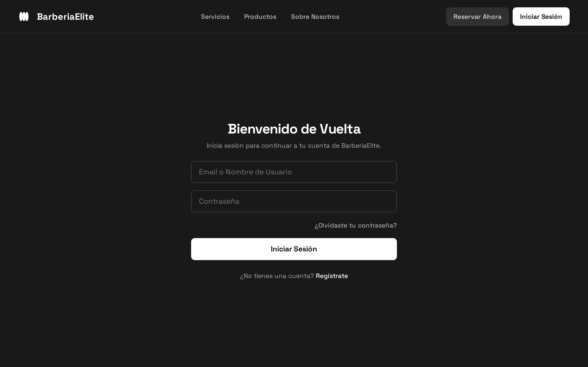
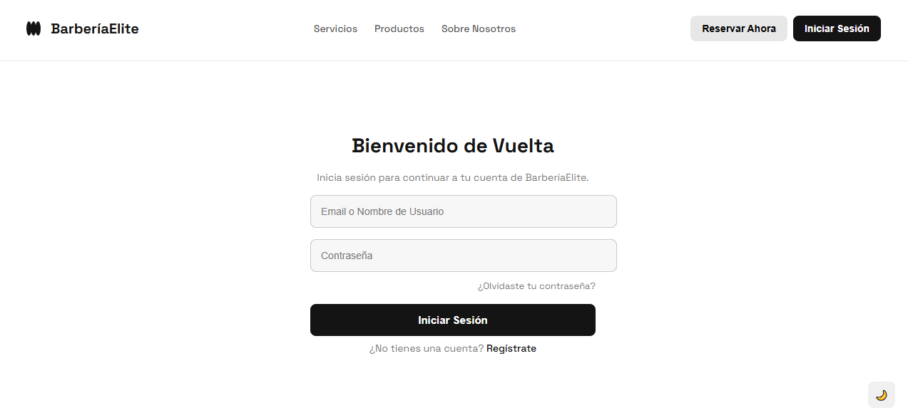
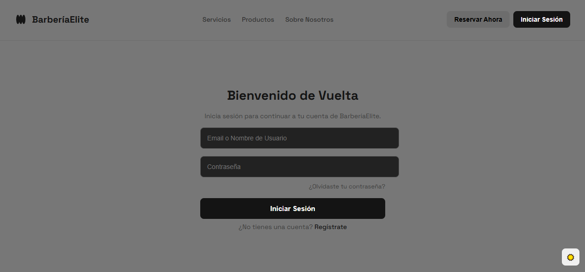

# 🎨 Diseño Front-End que cumpla con los requerimientos del proyecto

Este proyecto corresponde a la actividad **"Diseño front-end que cumpla con los requerimientos del proyecto"**, donde se desarrolló la interfaz gráfica de una página web para **BarberíaElite**, enfocada en la experiencia del usuario al iniciar sesión y navegar en la plataforma.

Link para ver el proyecto: https://iandrestm.github.io/actividad-academica/ 

---

## ✅ Requerimientos cumplidos
- Creación de una pantalla de **inicio de sesión** siguiendo el mockup diseñado previamente.
- Uso de **HTML y CSS puros** para la maquetación y estilos.
- Estructura clara y comentada en el código para su fácil comprensión.
- Simulación de interactividad con botones y formularios.

---

## 🛠️ Tecnologías utilizadas
- **HTML5** → estructura semántica del sitio.
- **CSS3** → estilos personalizados, responsividad y diseño visual.
- **Google Fonts** → tipografía moderna.
- **JavaScript** → de momento solo lo use para crear el Dark Mode.

---

## 🖼️ Mockup de la pantalla de inicio
> Este es el diseño original en Figma. el cual se le hicieron varios cambios como al ponerle el darkmode, se le aclaro un poco mas el modo oscuro y se le agrego el tema claro

---

## 🌐 Pantallas del proyecto en deploy
A continuación se muestran capturas del proyecto ya desplegado en la web:

### Pantalla de Inicio de Sesión
> Aca se muestra el proyecto en deploy con el modo claro

> Y aca muestra del proyecto en modo oscuro "darkmode"

---

## 👨‍💻 Autor
- **Andrés David Torres Márquez**  
- Estudiante de **Tecnología en Análisis y Desarrollo de Software**  
